# :minidisc: Song_Dalle


## :cd: Overview

노래 가사 요약문으로 앨범 아트 생성해주는 SongDALL-E


#### Docs

[Final Project 발표 PPT](https://github.com/juzero224/PROJECT3_SongDalle/blob/master/assets/%EB%82%98%EB%8A%94%EC%9E%90%EC%97%B0%EC%9D%B8%EC%9D%B4%EC%A1%B0.pdf)

[Notion](https://www.notion.so/Song-Dall-e-b35eac5ed25240f0a3f6a729a0f938e6)


#### WHY?

- text를 이미지로 변환해주는 딥러닝 기술의 발전
  - AI가 생성한 이미지가 예술 대회 1위 수상하는 뉴스와 이미지 생성에 대한 뉴스가 많이 뜨고 있음
- 이러한 딥러닝 기술을 노래 가사에 활용한다면 시각적 재미 :point_up: 


#### HOW?

- 노래 가사의 요약 문장 제공
- 노래 가사의 추상적, 주관적 특징으로 요약문의 한계점 존재 => 감성분석 제공
- 노래 가사의 요약 문장과 감성분석 결과를 나타내는 이미지 제공


#### Final Objection

- 여러 Text 종류 (수필, 에세이와 같은)를 Image화 해주는 모델
  - 책 표지, 짧은 영상의 대본을 토대로 한 썸네일 표지
  - 유아들을 대상으로 원하는 글귀를 넣으면 이미지가 나오는 상상력 증강 교육 프로그램으로 활용

<br>

<br>

## :cd: Tech Stack & Architecture

:round_pushpin: **Web** : `Django`

:round_pushpin: **Database** : `MySQL`

:round_pushpin: **Model** : `PyTorch`

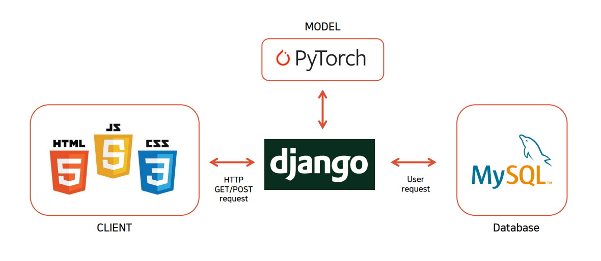

:round_pushpin: **Summarization** : `KoBART`

:round_pushpin: **Translation** : `PAPAGO API`

:round_pushpin: **Sentiment Analysis** : `KoBERT`

:round_pushpin: **Text-to_Image** : `RQ-Transformer`


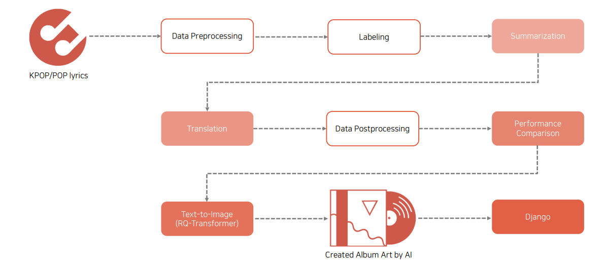

<br>

<br>

## :cd: Structure

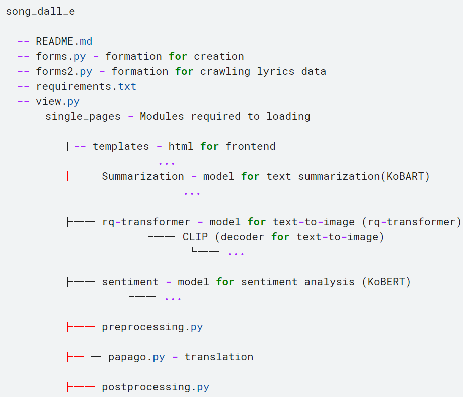

<br>

<br>

## :cd: Quick Start

#### :pushpin: Local에서 실행

:heavy_check_mark: Installation & Run

```
python -m venv venv
source venv/Scripts/activate
pip install -r requirements.txt
pip install -r requirement3.txt
python manage.py makemigrations
python manage.py migrate
python manage.py runserver
```

<br>

<br>

## :cd: Homepage Configuration

:one:  **메인 화면**

- Song DALL-E 홈페이지 메인 페이지 입니다.

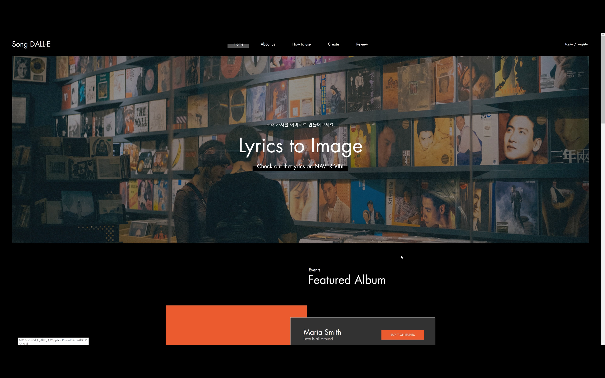

<br>

- 팀원 소개 페이지 입니다.

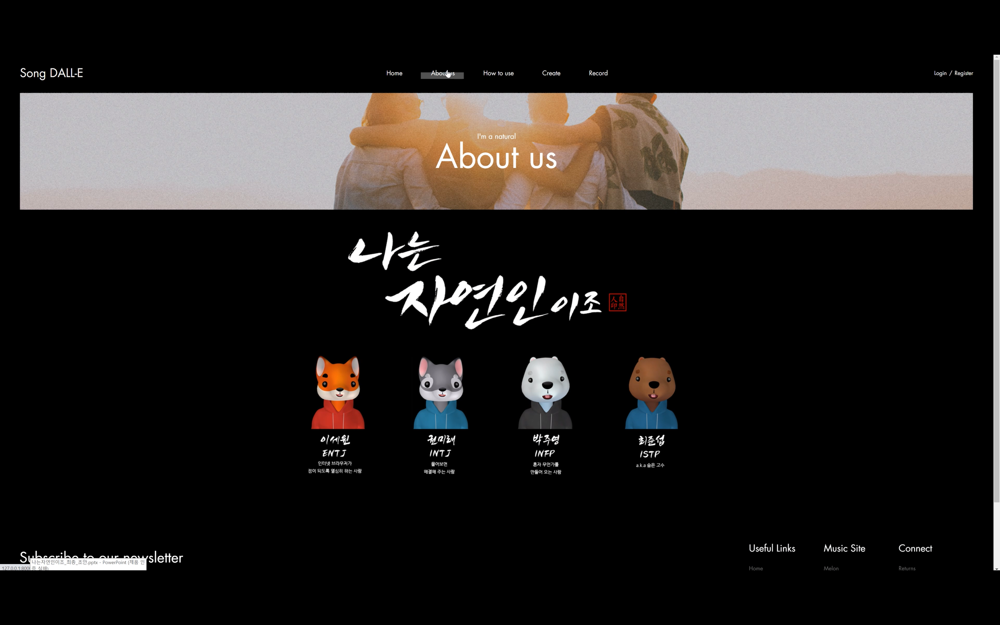

<br>

:two: **How to use 페이지**

- 송달리 사용법과 기록들을 볼 수 있습니다.
- 해당 이미지를 클릭하면 해당 노래 정보를 알 수 있습니다. 또한 사용된 Keyword, 노래 가사 감성분석한 결과, 요약된 문장과 함께 결과 이미지를 확인할 수 있습니다.

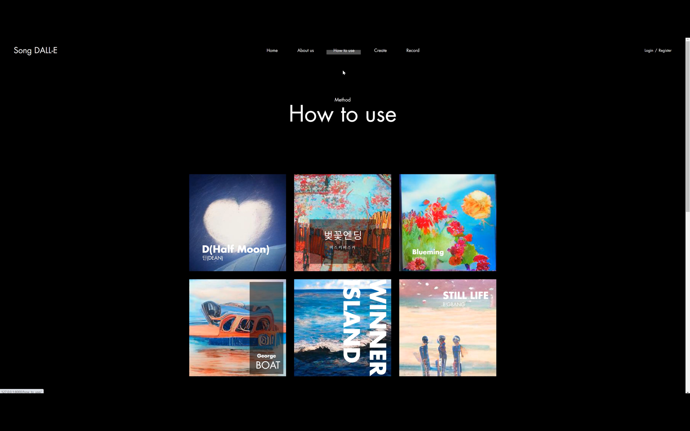

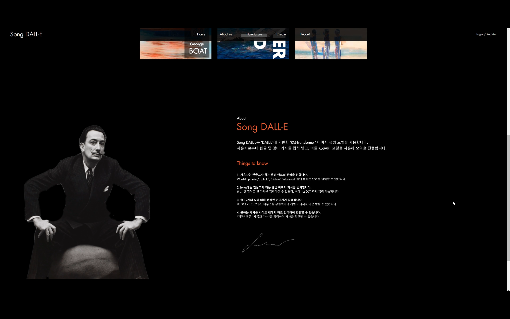

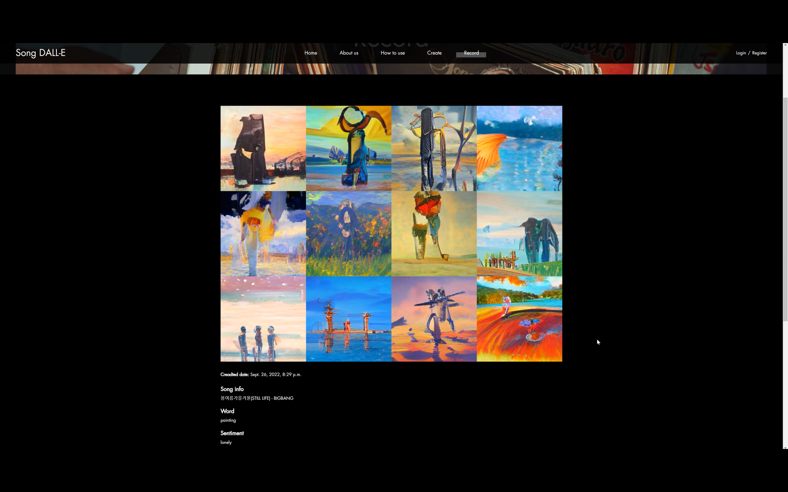

<br>

:three: **검색 페이지**

- 찾고 싶은 노래 가사를 검색할 수 있습니다.
- 찾고자 하는 가사가 맞다면 Copy를 눌러 복사합니다.

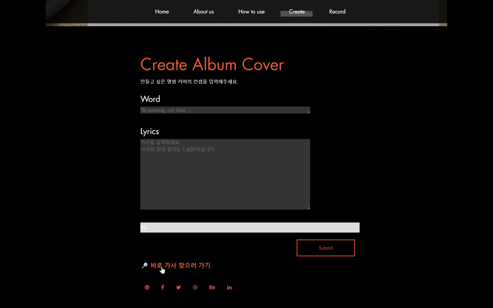


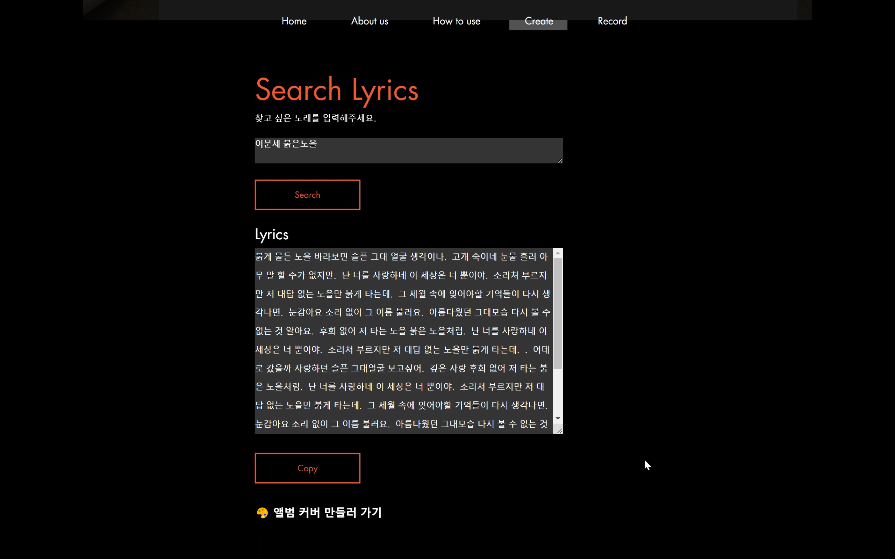

<br>

:four: **Create Album Cover 페이지**

- 만들고 싶은 앨범 커버의 컨셉 Keyword를 넣습니다.
- 복사한 가사나 작사한 가사를 Lyrics 공간에 넣습니다.
- 약 40초 후, 결과 페이지를 확인할 수 있습니다.
- 가사와, 요약된 문장, 감성분석 결과를 확인할 수 있으며 12개의 이미지 중 원하는 이미지를 다운로드할 수 있습니다.

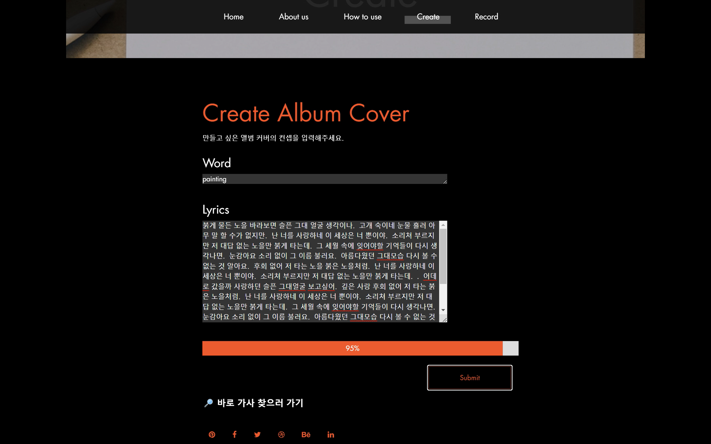

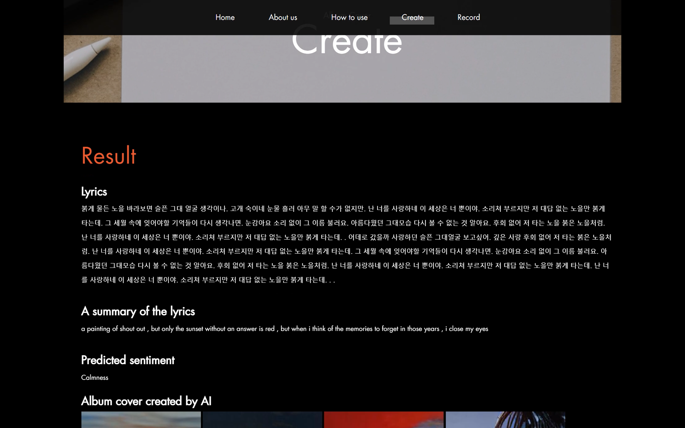


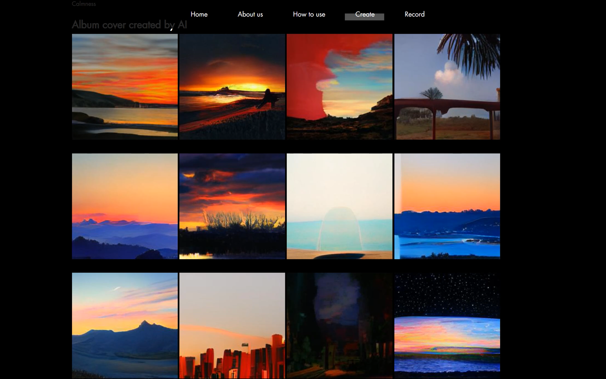

<br>

<br>

## :cd: Modeling

Lyrics Summarization Model

```python
hparams_path = './Summarization/logs/tb_logs/default/version_7/hparams.yaml'
model_binary_path = './Summarization/logs/model_chp/epoch=09-val_loss=1.582.ckpt'

def get_model_binary(self):

  parser = argparse.ArgumentParser()
  parser.add_argument("--hparams", default=None, type=str)
  parser.add_argument("--model_binary", default=None, type=str)
  parser.add_argument("--output_dir", default='./Summarization/kobart_summary', type=str)
  args = parser.parse_args()

  with open(args.hparams) as f:
      hparams = yaml.load(f)
        
  inf = KoBARTConditionalGeneration.load_from_checkpoint(args.model_binary, hparams=hparams)
  inf.model.save_pretrained(args.output_dir)
```


Lyrics Sentiment Analysis


Text to Image Model

<br>

<br>

## :cd: References

#### Datasets

- [Melon](https://www.melon.com/) Crawling


#### Models

**Text-to-Image**

- [kakaobrain/minDALL-E](https://github.com/kakaobrain/minDALL-E.git)

- [kakaobrain/rq-vae-transformer](https://github.com/kakaobrain/rq-vae-transformer.git)

**Summarization**

- [TextRank](https://github.com/davidadamojr/TextRank.git)

- [openAI/gpt-2](https://github.com/openai/gpt-2.git)
- [google-research/T5:text-to-text-transfer-transformer](https://github.com/google-research/text-to-text-transfer-transformer.git)

- [SKT-AI/KoBART](https://github.com/SKT-AI/KoBART.git)

**Sentiment Analysis**

- [facebookresearch/fairseq/roberta](https://github.com/facebookresearch/fairseq.git)
- [SKTBrain/KoBERT](https://github.com/SKTBrain/KoBERT.git)